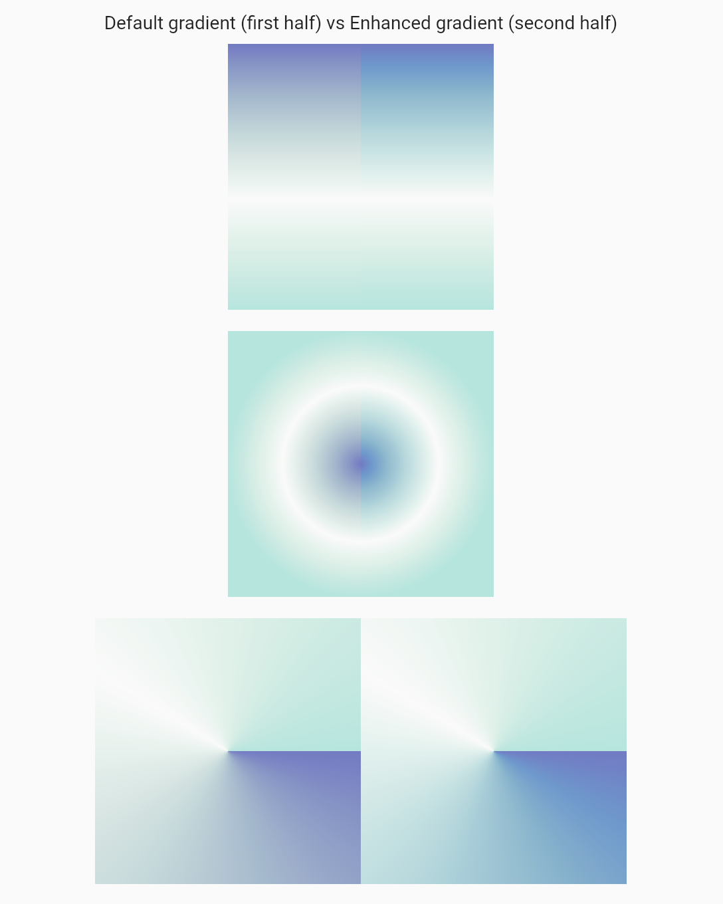
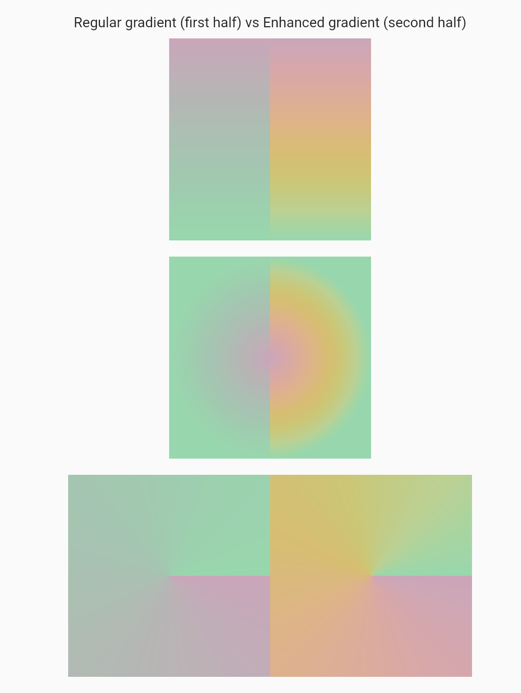
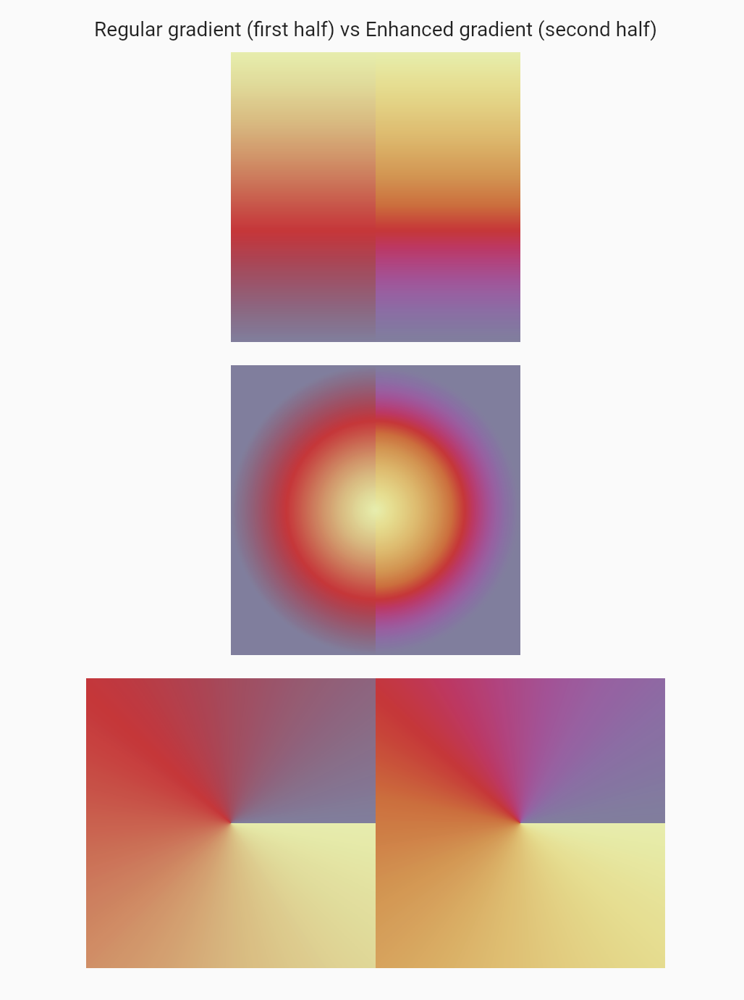

# enhanced_gradients

[![enhanced_gradients pub.dev badge][pub-badge]][pub-badge-link]
[![][build-badge]][build-badge-link]

This package adds an easy way to enhance your Flutter gradients and color transitions by interpolating colors
in the HCT color system provided by the [material_color_utilities package](https://pub.dev/packages/material_color_utilities).

## Usage

The package exposes two ways to modify the built-in `LinearGradient`, `RadialGradient` and `SweepGradient` gradients:

```dart
// 1st way: extension method

LinearGradient(
  colors: const [Color(0xFF000000), Color(0xFFFFFFFF)],
  // ...
).enhanced()

RadialGradient(
  colors: const [Color(0xFF000000), Color(0xFFFFFFFF)],
  // ...
).enhanced()

SweepGradient(
  colors: const [Color(0xFF000000), Color(0xFFFFFFFF)],
  // ...
).enhanced()
```

```dart
// 2nd way: `Enhanced*Gradient` class

EnhancedLinearGradient(
  colors: const [Color(0xFF000000), Color(0xFFFFFFFF)],
  // ...
)

EnhancedRadialGradient(
  colors: const [Color(0xFF000000), Color(0xFFFFFFFF)],
  // ...
)

EnhancedSweepGradient(
  colors: const [Color(0xFF000000), Color(0xFFFFFFFF)],
  // ...
)
```

There is also a `HctColorTween` that can be used instead of the regular `ColorTween` to interpolate
colors in the HCT color system in Flutter animations.

[pub-badge]: https://img.shields.io/pub/v/enhanced_gradients
[pub-badge-link]: https://pub.dev/packages/enhanced_gradients
[build-badge]: https://img.shields.io/github/actions/workflow/status/leancodepl/flutter_corelibrary/enhanced_gradients-test.yml?branch=master
[build-badge-link]: https://github.com/leancodepl/flutter_corelibrary/actions/workflows/enhanced_gradients-test.yml

## Examples

The following examples are screenshots taken in the example app of randomly generated gradients. Note that the HCT gradients might not always look better than the regular ones, as it is all subjective and depends on the desired effect.






