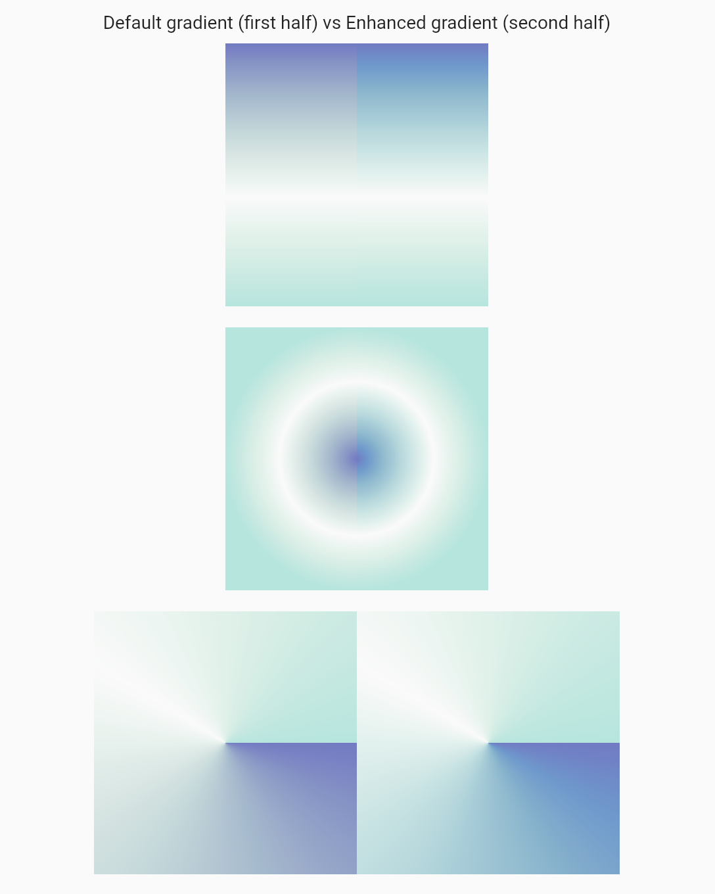

# example

This example app displays a simple comparison between regular and enhanced gradients. The simplest way to
start it is to run it via `flutter run -d chrome`. Use the floating action button to shuffle gradients' colors.

