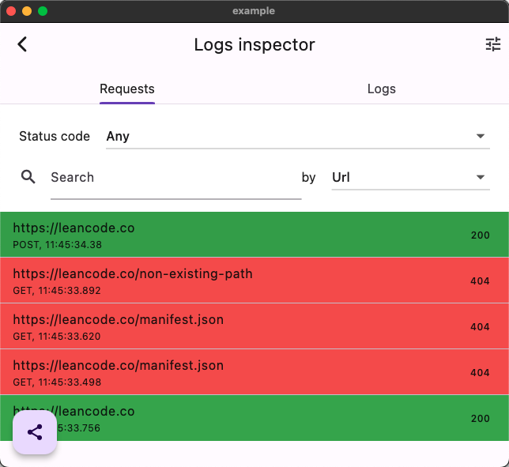
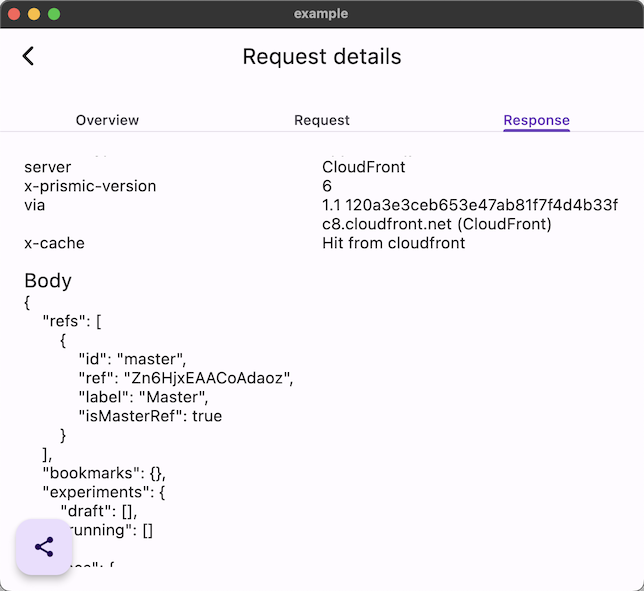

# leancode_debug_page

A debug page that gathers HTTP requests and logger logs. Features:

- Detailed information about requests (request, response) and logs
- Filtering requests by
  - Status code
  - Search
- Filtering logs by
  - Log level
  - Search
- Sharing
  - All logs / requests
  - Individual items
- Two configurable entry points
  - Draggable floating action button
  - Device shake

<br>


<p style="text-align: center;">
Requests list
</p>
<br>



<p style="text-align: center;">
Request details
</p>
<br>


<p style="text-align: center;">
Logs list
</p>


## Usage

You only have to wrap your ```MaterialApp``` with ```DebugPageOverlay``` and provide a ```DebugPageController```. ```DebugPageController``` requires a ```LoggingHttpClient```, which is a wrapper over ```Client``` from dart's ```http``` package. This allows you to put your implementation of client in there.

```dart
class MyApp extends StatefulWidget {
  const MyApp({
    super.key,
    required LoggingHttpClient loggingHttpClient,
  }) : _loggingHttpClient = loggingHttpClient;

  final LoggingHttpClient _loggingHttpClient;

  @override
  State<MyApp> createState() => _MyAppState();
}

class _MyAppState extends State<MyApp> {
  _MyAppState();

  late DebugPageController _debugPageController;

  @override
  void initState() {
    super.initState();

    _debugPageController = DebugPageController(
      showEntryButton: true,
      loggingHttpClient: widget._loggingHttpClient,
    );
  }

  @override
  Widget build(BuildContext context) {
    return DebugPageOverlay(
      controller: _debugPageController,
      child: MaterialApp(
        title: 'Debug Page Demo',
        theme: ThemeData(
          colorScheme: ColorScheme.fromSeed(seedColor: Colors.deepPurple),
          useMaterial3: true,
        ),
        home: MyHomePage(
          title: 'Flutter Debug Page Demo Page',
          loggingHttpClient: widget._loggingHttpClient,
        ),
      ),
    );
  }

  @override
  void dispose() {
    _debugPageController.dispose();

    super.dispose();
  }
}
```

For a complete working sample, see [example](example).

You can configure debug page's entry points by setting ```showEntryButton``` (defaults to false) and ```showOnShake``` (defaults to true) flags in the constructor of ```DebugPageController```.

## Warning

For gathering logs from loggers, this package relies on listening to `Logger.root`. This means that changing `Logger.root.level` affects this package's behavior, and the logs are only collected from the current isolate.
